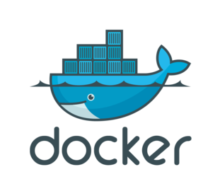
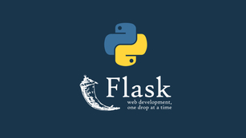

# <font color = berry >Banking Chatbot </font>


## Objective
1. Data Preparation 
2. Data Modeling and Evaluation
3. Deployment


## Overview
Jawebni is  an Intelligent chatbot that can find the best answer to any request
## Dataset Information
The dataset is stored in mongodb database and contain three essential columns question , answer and explication 

## Technologies Used


###Python 3.9.5


###MongoDB 

###Docker

###Flask 2.0

#How to set up the project? 

you need to have a docker environment installed than execute both these commands : 

```docker
docker build -t chatbot_final .    
```
```docker
docker run --name  chatbot_final   -p 8000:8000 chatbot_final     
```